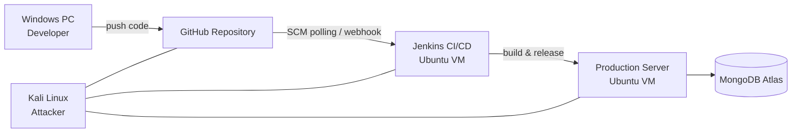
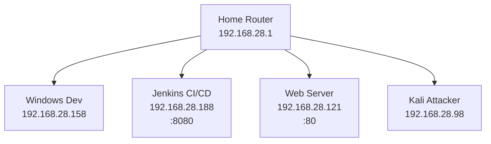
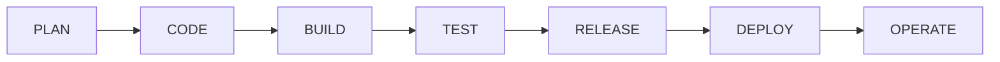

# 🛡️ Kama Task Manager – DevSecOps CI/CD Lab (PoC)

> **A hands-on DevSecOps & CI/CD security laboratory** built from scratch to simulate **real-world insecure pipelines**, perform **offensive security testing**, and then **progressively harden** the system following DevSecOps best practices.

This project demonstrates **how modern CI/CD pipelines fail**, **how attackers exploit them**, and **how to secure them step by step** — not just theory.

---

## 🎯 Project Goals

* Build a **realistic CI/CD pipeline** from zero
* Intentionally start **insecure**
* Perform **active pentesting** (pipeline, host, network, credentials)
* Apply **incremental hardening**
* Document everything as a **recruiter-ready PoC**
* Prepare for future extensions:

  * Kubernetes
  * Monitoring (ELK / Prometheus)
  * Infrastructure as Code (Terraform)

---

## 🧱 High-Level Architecture (Initial Lab)



---

## 🌐 Network Topology (Bridged LAN)


All machines are placed on the **same Layer-2 LAN** using **VMware Bridged Networking** to simulate a real enterprise environment.




---

## 🖥️ Hosts & Roles

| Host          | Role       | Key Services     |
| ------------- | ---------- | ---------------- |
| Windows PC    | Developer  | VS Code, Git     |
| Ubuntu CI VM  | CI/CD      | Jenkins, Docker  |
| Ubuntu Web VM | Production | Docker, App      |
| Kali Linux    | Attacker   | Nmap, Metasploit |
| MongoDB Atlas | Database   | External SaaS    |

---

## 🚀 Application Overview

* **Backend:** Node.js (Express)
* **Frontend:** Static HTML/CSS/JS
* **Auth:** JWT
* **Database:** MongoDB Atlas
* **Containerized:** Single Docker image (frontend + backend)

---

## 🔁 CI/CD Pipeline – Workflow



### Implemented Stages

1. **Checkout**

   * Jenkins pulls code from GitHub
2. **Build**

   * Docker image built inside Jenkins
3. **Release**

   * Image exported (`docker save`)
4. **Deploy**

   * Image shipped over SSH
   * Loaded on production server
5. **Run**

   * Docker Compose recreates container

---

## ⚙️ Jenkins Pipeline (Key Characteristics)

* Jenkins runs **inside a Docker container**
* Docker socket mounted (**high-risk on purpose**)
* SSH key-based deployment to production
* SCM-triggered builds (GitHub changes)
* No secrets manager initially (intentional)

---

## ⚠️ Intentionally Insecure Design (Phase 1)

The lab **started insecure by design** to enable realistic attacks:

* Docker socket exposed to Jenkins
* Jenkins runs with excessive privileges
* SSH trust established without hardening
* Secrets passed via environment variables
* No image scanning
* No branch protection
* No network segmentation
* No TLS initially

---

## 🔴 Pentesting Phase (Offensive Security)

Using **Kali Linux**, multiple attack paths were explored:

### Network Recon

```bash
nmap -sS -T4 --top-ports 100 192.168.28.0/24
```

**Discovered:**

* Jenkins exposed on `:8080`
* Production web app on `:80`
* SSH on production host

---

### CI/CD Attack Scenarios Tested

* SCM poisoning (malicious commit)
* Jenkins workspace abuse
* Docker socket privilege escalation
* SSH lateral movement
* Image tampering before deployment
* Supply-chain trust violations

> These attacks demonstrated how **CI = production root** when misconfigured.

---

## 🛡️ Hardening Phase (DevSecOps)

After validating attack paths, the environment was **progressively hardened**.

### Key Improvements

* Dedicated `deploy` user on production
* SSH key-based deployment (non-root)
* Immutable image releases
* Separation of build vs runtime concerns
* Removal of legacy containers
* Controlled container recreation
* SCM-triggered builds verified

> The goal was **risk reduction**, not perfect security.

---

## 📦 Docker Compose (Production)

```yaml
services:
  backend:
    image: kama-web-tasks:release
    container_name: kama-tasks-prod
    ports:
      - "80:3000"
    environment:
      MONGO_URI: "<redacted>"
      JWT_SECRET: "<redacted>"
      JWT_EXPIRES_IN: "7d"
    restart: unless-stopped
```

---

## 🔐 Security Lessons Learned

* CI/CD systems are **Tier-0 assets**
* Docker socket = root on host
* SCM access == production access
* “Works” ≠ “Secure”
* Attackers don’t need zero-days — just trust abuse

---

## 📈 What This Project Demonstrates

✔ Real CI/CD design
✔ Offensive security mindset
✔ Blue-team remediation
✔ DevSecOps thinking
✔ Infrastructure understanding
✔ Recruiter-ready PoC

---

## 🔮 Future Extensions (Planned)

* Kubernetes (EKS / k3s)
* Image scanning (Trivy)
* Secrets management (Vault)
* Monitoring (Prometheus / ELK)
* IaC (Terraform)
* Zero-Trust networking
* Policy-as-Code

---

## 🧠 Final Note

This project is **not a tutorial clone**.
It is a **thinking lab** — built, broken, attacked, and fixed intentionally.

> *“Security is understanding how things fail.”*

---

If you want, next we can:

* Polish this README visually
* Add **attack diagrams per phase**
* Write a **LinkedIn post** explaining this project like a senior engineer
* Prepare **interview talking points** based on this lab

Just tell me 💪
